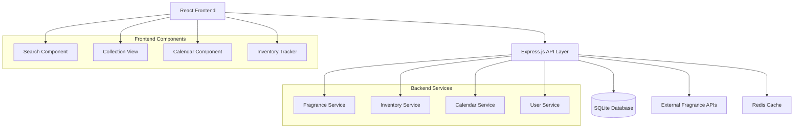

# Design Document

## Overview

The Fragrance Collection Tracker is a web application that enables users to manage their personal fragrance collections with comprehensive tracking capabilities. The system integrates with external fragrance databases to simplify adding new fragrances while providing robust inventory management and usage tracking through a calendar interface.

## Architecture

The application follows a modern web architecture with clear separation of concerns:



**Technology Stack:**
- Frontend: React with TypeScript, React Router, Material-UI or Tailwind CSS
- Backend: Node.js with Express.js and TypeScript
- Database: SQLite for local development, PostgreSQL for production
- Caching: Redis for API response caching
- External APIs: Fragrantica scraping API or similar fragrance database services

## Components and Interfaces

### Frontend Components

#### FragranceSearch Component
- Handles fragrance lookup from external APIs
- Provides autocomplete search functionality
- Displays search results with fragrance details
- Allows selection and addition to collection

#### CollectionView Component
- Displays user's fragrance collection in grid/list format
- Supports filtering and sorting (brand, rating, inventory level, last worn)
- Shows inventory status indicators
- Provides quick actions (edit, rate, mark as worn)

#### CalendarComponent
- Monthly/weekly calendar view
- Shows fragrances worn on each day
- Allows adding/editing daily fragrance entries
- Displays usage patterns and statistics

#### InventoryTracker Component
- Manages bottle sizes and fill levels
- Tracks usage over time
- Provides low inventory alerts
- Calculates estimated remaining days

#### FragranceDetail Component
- Comprehensive fragrance information display
- Editable fields for personal notes and ratings
- Usage history and statistics
- Purchase information tracking

### Backend Services

#### FragranceService
```typescript
interface FragranceService {
  searchExternal(query: string): Promise<ExternalFragrance[]>
  createFragrance(data: CreateFragranceDto): Promise<Fragrance>
  getUserFragrances(userId: string, filters?: FragranceFilters): Promise<Fragrance[]>
  updateFragrance(id: string, data: UpdateFragranceDto): Promise<Fragrance>
  deleteFragrance(id: string): Promise<void>
}
```

#### InventoryService
```typescript
interface InventoryService {
  updateInventory(fragranceId: string, usage: UsageEntry): Promise<Inventory>
  getInventoryStatus(fragranceId: string): Promise<InventoryStatus>
  getLowInventoryAlerts(userId: string): Promise<LowInventoryAlert[]>
  calculateRemainingDays(fragranceId: string): Promise<number>
}
```

#### CalendarService
```typescript
interface CalendarService {
  recordDailyWear(userId: string, date: Date, fragrances: DailyWearEntry[]): Promise<void>
  getDailyWear(userId: string, date: Date): Promise<DailyWearEntry[]>
  getWearHistory(userId: string, dateRange: DateRange): Promise<WearHistory[]>
  getUsageStatistics(userId: string, fragranceId?: string): Promise<UsageStats>
}
```

## Data Models

### Core Entities

#### Fragrance
```typescript
interface Fragrance {
  id: string
  userId: string
  name: string
  brand: string
  year?: number
  concentration?: string // EDT, EDP, Parfum, etc.
  notes: {
    top: string[]
    middle: string[]
    base: string[]
  }
  externalId?: string // Reference to external database
  personalRating?: number // 1-10 scale
  personalNotes?: string
  purchaseInfo?: {
    date: Date
    price: number
    retailer: string
  }
  listType: 'owned' | 'tried' | 'wishlist'
  createdAt: Date
  updatedAt: Date
}
```

#### Inventory
```typescript
interface Inventory {
  id: string
  fragranceId: string
  bottleSize: number // in ml
  currentLevel: number // percentage 0-100
  purchaseDate: Date
  openedDate?: Date
  usageTracking: boolean
  lowThreshold: number // percentage for alerts
  estimatedDaysRemaining?: number
  createdAt: Date
  updatedAt: Date
}
```

#### DailyWear
```typescript
interface DailyWear {
  id: string
  userId: string
  date: Date
  fragrances: {
    fragranceId: string
    sprayCount?: number
    bodyParts?: string[] // wrists, neck, etc.
    notes?: string
  }[]
  weather?: string
  occasion?: string
  createdAt: Date
}
```

#### UsageEntry
```typescript
interface UsageEntry {
  id: string
  fragranceId: string
  date: Date
  sprayCount: number
  estimatedUsage: number // in ml
  notes?: string
  createdAt: Date
}
```

### External API Integration

#### ExternalFragrance
```typescript
interface ExternalFragrance {
  id: string
  name: string
  brand: string
  year?: number
  concentration?: string
  notes: {
    top: string[]
    middle: string[]
    base: string[]
  }
  imageUrl?: string
  description?: string
  source: 'fragrantica' | 'parfumo' | 'manual'
}
```

## Error Handling

### API Error Responses
- Standardized error format with error codes and messages
- Graceful degradation when external APIs are unavailable
- Retry logic for transient failures
- User-friendly error messages in the UI

### Data Validation
- Input validation on both frontend and backend
- Schema validation using libraries like Joi or Zod
- Sanitization of user inputs
- Proper handling of malformed external API responses

### Offline Functionality
- Local storage for recently viewed fragrances
- Cached search results for offline browsing
- Queue system for actions performed while offline
- Sync mechanism when connection is restored

## Testing Strategy

### Unit Testing
- Service layer testing with mocked dependencies
- Component testing with React Testing Library
- Database model testing with test database
- Utility function testing

### Integration Testing
- API endpoint testing with supertest
- Database integration testing
- External API integration testing with mock servers
- End-to-end user workflow testing

### Test Data Management
- Seed data for development and testing
- Factory functions for creating test entities
- Database cleanup between tests
- Mock external API responses

### Performance Testing
- Load testing for search functionality
- Database query optimization testing
- Frontend performance monitoring
- API response time benchmarking

## Security Considerations

### Authentication & Authorization
- User authentication with JWT tokens
- Session management and token refresh
- Role-based access control (future enhancement)
- Secure password storage with bcrypt

### Data Protection
- Input sanitization to prevent XSS attacks
- SQL injection prevention with parameterized queries
- Rate limiting on API endpoints
- CORS configuration for frontend-backend communication

### Privacy
- User data encryption at rest
- Secure handling of personal fragrance data
- Optional data export functionality
- Clear data retention policies

## Performance Optimization

### Caching Strategy
- Redis caching for external API responses
- Browser caching for static assets
- Database query result caching
- Pagination for large collections

### Database Optimization
- Proper indexing on frequently queried fields
- Query optimization for complex searches
- Connection pooling
- Database migration strategy

### Frontend Optimization
- Code splitting and lazy loading
- Image optimization and lazy loading
- Debounced search inputs
- Virtual scrolling for large lists